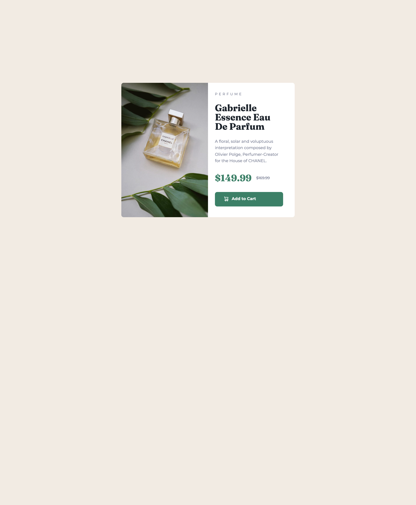

# Frontend Mentor - Product preview card component solution

This is a solution to the [Product preview card component challenge on Frontend Mentor](https://www.frontendmentor.io/challenges/product-preview-card-component-GO7UmttRfa). Frontend Mentor challenges help you improve your coding skills by building realistic projects. 

## Table of contents

- [Overview](#overview)
  - [The challenge](#the-challenge)
  - [Screenshot](#screenshot)
  - [Links](#links)
- [My process](#my-process)
  - [Built with](#built-with)
  - [What I learned](#what-i-learned)
  - [Continued development](#continued-development)
  - [Useful resources](#useful-resources)
- [Author](#author)

## Overview

### The challenge

Users should be able to:

- View the optimal layout depending on their device's screen size
- See hover and focus states for interactive elements

### Screenshot

### Links

- Solution URL: [GitHub Repo](https://github.com/tmelnychenko/product-preview-card-component)
- Live Site URL: [GitHub Pages - Product Preview Card Component](https://tmelnychenko.github.io/product-preview-card-component/)

## My process

### Built with

- Semantic HTML5 markup
- SASS
- Flexbox
- CSS Grid
- Mobile-first workflow
- Custom fonts

### What I learned

I refreshed my knowledge of CSS Grid, Flex and SASS usage.

### Continued development

I will continue focusing on modern HTML/CSS techniques and practical usage of them

### Useful resources

- [Usage of media queries in SASS](https://medium.com/@goncakoprulu/practical-and-life-saving-uses-of-scss-media-queries-7ffed3ebff5d) - This helped me to create elegant solution for different sizes of screen.

## Author

- Frontend Mentor - [@tmelnychenko](https://www.frontendmentor.io/profile/tmelnychenko)